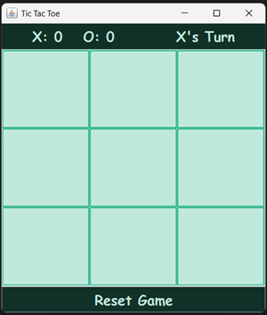
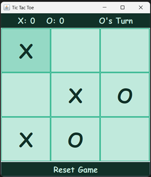
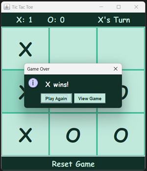
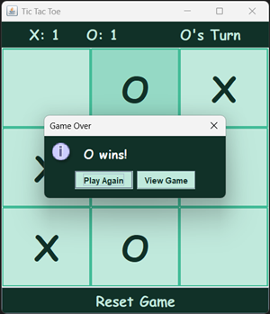
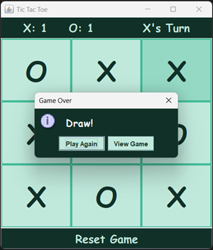
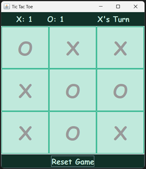

Tic-Tac-Toe Game

Overview

A simple Java-based Tic-Tac-Toe game. Two players can take turns on a 3x3 grid, with the game tracking scores and determining the winner or a draw. Features include a reset button, player turn indication, and a stylish UI.

Features

- Two-player turn-based gameplay.
- 3x3 grid with an interactive GUI.
- Score tracking for both players.
- Reset button to start a new game.
- Player turn indicator.
- Stylish and user-friendly interface.

Installation & Usage

Clone the repository:

git clone https://github.com/valrincon/TicTacToeJava.git

cd TicTacToeJava

Compile and run the game:

javac TicTacToe.java

java TicTacToe

Screenshots

Empty Game:

Gameplay:

X being the winner:

O being the winner:

The game ends in a draw:

View Game:

Technologies Used
- Java
- Swing (for UI components)